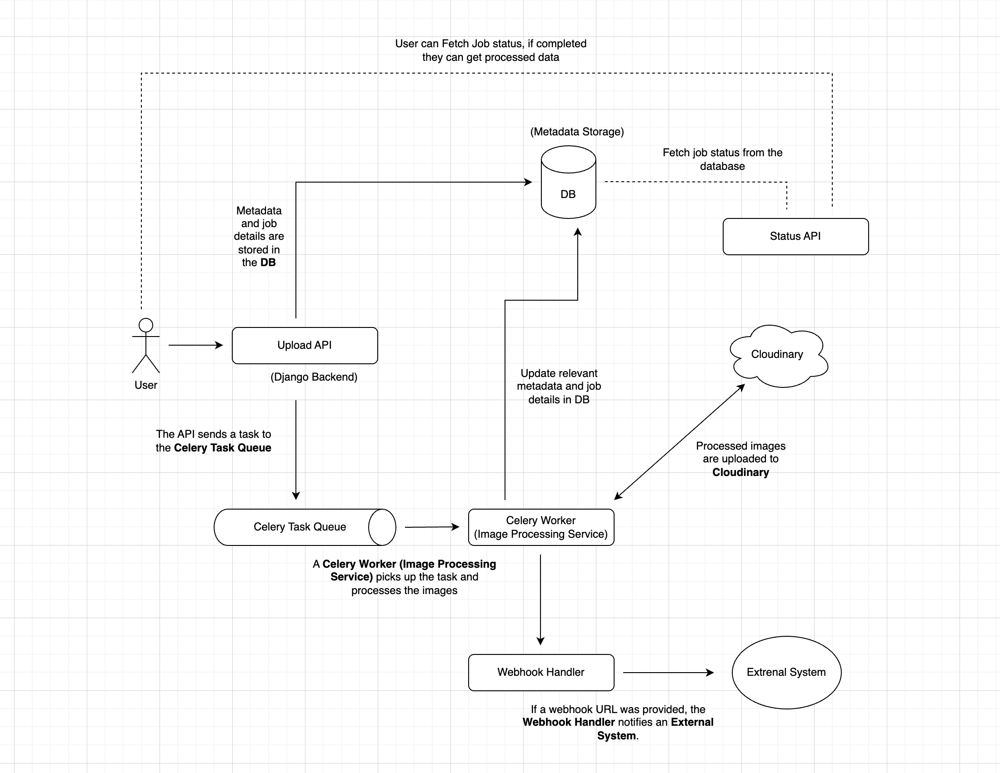

# Image Processing System - Low-Level Design (LLD)

## 1. System Overview

This stateless system processes image data from CSV files, compresses the images asynchronously, and provides APIs for status tracking and webhook notifications.

## 2. High-Level Architecture

### Components:

1. **Upload API**

   - Accepts a CSV file and validates the format.
   - Stores the request in the database and returns a unique request ID.
   - Triggers the asynchronous image processing.
   - Optionally accepts a webhook URL to notify upon completion.

2. **Image Processing Service**

   - Fetches images from URLs.
   - Compresses images by reducing quality by 50%.
   - Stores processed images in **Cloudinary**.
   - Updates the database with output image URLs.
   - Sends a webhook notification when processing is complete.

3. **Status API**

   - Allows users to check processing status using the request ID.
   - Returns input and output image details.

4. **Output CSV API**

   - Allows users to download a CSV file with input and output image URLs.
   - Returns a CSV file with the processed image data.

5. **Database**

   - Stores CSV metadata, image processing statuses, and input/output URLs.
   - No user table is needed, as the system is stateless.

6. **Storage Service**

   - Stores processed images in **Cloudinary**.

7. **Webhook Handling**

   - Notifies an external system when all images are processed.

## 3. API Endpoints

### 1. **Upload API**

- **Endpoint:** `POST /upload`
- **Request:** CSV file upload and optional webhook URL
- **Response:** `{ "request_id": "<unique_id>" }`

### 2. **Status API**

- **Endpoint:** `GET /status/{request_id}`
- **Response:** Processing status and image URLs

### 3. **Output CSV API**

- **Endpoint:** `GET /output_csv/{request_id}`
- **Response:** CSV file with input and output image URLs

### 4. **Webhook Endpoint**

- **Triggered When:** Image processing is completed
- **Payload:** `{ "request_id": "<unique_id>", "status": "completed", "output_images": ["url1", "url2"] }`

## 4. Database Schema & Justification

### **Database Choice: SQL (PostgreSQL)**

We are using a **SQL database** (PostgreSQL) due to:

- **Relational Data Structure:** The system requires structured relationships between jobs and images.
- **ACID Compliance:** Ensures consistency and reliability for processing jobs.
- **Indexing & Query Optimization:** SQL databases allow efficient queries for tracking processing statuses.
- **Scalability & Maintainability:** PostgreSQL offers better performance for structured data than NoSQL for this use case.

### **Tables:**

#### `processing_jobs`

| Column      | Type      | Description                          |
| ----------- | --------- | ------------------------------------ |
| job_id      | VARCHAR   | Unique identifier for each job       |
| status      | ENUM      | `pending`, `processing`, `completed` |
| webhook_url | TEXT      | URL to notify upon completion        |
| created_at  | TIMESTAMP | Job submission time                  |
| updated_at  | TIMESTAMP | Last update time                     |

#### `images`

| Column     | Type      | Description                               |
| ---------- | --------- | ----------------------------------------- |
| id         | INT       | Auto-increment primary key                |
| job_id     | VARCHAR   | Foreign key referencing `processing_jobs` |
| input_url  | TEXT      | Original image URL                        |
| output_url | TEXT      | Processed image URL                       |
| status     | ENUM      | `pending`, `processed`                    |
| created_at | TIMESTAMP | Record creation time                      |
| updated_at | TIMESTAMP | Last update time                          |

## 5. Image Processing Workflow

1. **Upload API** receives CSV and creates an entry in `processing_jobs`.
2. **Image Processing Service** fetches, compresses, and stores images in **Cloudinary**.
3. The database is updated with output image URLs.
4. **Webhook** is triggered after all images are processed if a webhook URL is provided.
5. Users can check status via the **Status API**.
6. Users can download the processed image data via the **Output CSV API**.

## 6. Image Compression Strategy

- **Library Used:** Pillow (Python Imaging Library)
- **Method:** Reduce JPEG quality by 50% while maintaining visibility.
- **Format:** Output images remain in the original format.
- **Storage:** Compressed images are uploaded to **Cloudinary**.
- **Implementation:**

  ```python
  import cloudinary.uploader

  response = cloudinary.uploader.upload("compressed.jpg", folder="processed_images")
  print(response["secure_url"])
  ```

## 7. Tech Stack

- **Backend:** Django
- **Database:** PostgreSQL
- **Storage:** Cloudinary (alternatively AWS S3)
- **Asynchronous Processing:** Celery + Redis
- **Infrastructure:** Deployed on AWS/Render



## 8. AWS S3 vs Cloudinary

| Feature                  | Cloudinary                               | AWS S3                                       |
| ------------------------ | ---------------------------------------- | -------------------------------------------- |
| **Ease of Setup**        | Easy to set up with comprehensive SDKs   | Requires more configuration and setup        |
| **Cost**                 | Cost-effective with a free tier          | Can be more expensive for high usage         |
| **Image Processing**     | Built-in image processing capabilities   | Requires additional services for processing  |
| **CDN Integration**      | Integrated CDN for fast delivery         | Requires separate setup for CDN              |
| **Documentation**        | Comprehensive and easy to follow         | Extensive but can be complex                 |
| **Use Case Suitability** | Ideal for small to medium-sized projects | Suitable for large-scale enterprise projects |

> Cloudinary was chosen over AWS S3 due to its ease of setup, cost-effectiveness, built-in image processing capabilities, and CDN integration, making it a more suitable choice for this project.
